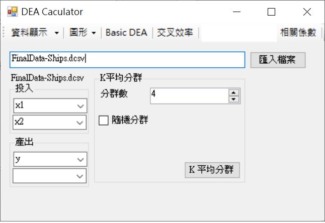

# DEA

Rebuild SCI Model: http://www.mdpi.com/2071-1050/8/7/600

Lib: Microsoft Solver Foundation (Free)

Stratifying DMU + Clustering DMU (K-mean) -> Benchmarking Network

Purpose: 
	The model can build a stepwise benchmarking Network.
	That can make target improve their performance more efficiency.
	
Confuse:
	1.In case that the layers are too much. -> Reduce layers.
	2.Some DMUs deviation from main group. 	-> Try another clustering method.
	
Screenshot:

- Main Form

- Read DEA Data and Set Input、Output Data

- View Raw Data

- View Scatter Chart of Input Data

- Tab List

- View Cross Efficiency

- Read Cross Efficiency Data

- Log of K Mean Clustering

